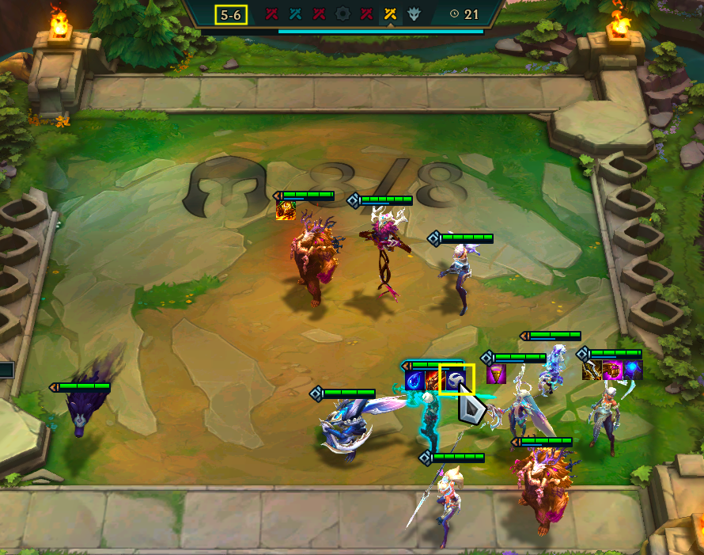

# Teamfight Tactics Stats

## What is TFT?
Teamfight Tactics is a free-for-all auto-battler video game. Your goal is to grow your team of champions and be the last player standing. For more information, see https://teamfighttactics.leagueoflegends.com/en-us/news/game-updates/what-is-teamfight-tactics/.

The gameplay is split into stages, each having seven rounds. Stage 1 is special in that there are only four rounds. 

## What is TFT Stats?
TFTStats is a statistics tracker that help players improve by using players' game results to display meaningful statistics for all areas of the game.

## Entering data
### How and when to enter data
TFTStats requires players to input the game state as it progresses. Since this is difficult to do in the middle of the game, the player only needs to screenshot their game at the start of a few rounds. In particular:
- Stage 1: screenshot at the start of round 2.
- Stages 2-4: screenshot at start of round 1, 2, and 5. The screenshot at round 1 will help you fill out the last bit of information from the previous stage.
- Stage 5+: screenshot at start of round 1 and 5.
When you die, it is unlikely you will have time to screenshot your final game state. Instead, go to https://lolchess.gg/leaderboards, select your region and input your username. Find your game and use it input your final game state into the app.

Here's a demo on how to input game results:

1. On the Home page, click the + button.
2. Your game has started. You have just picked an item from the carousel. Take a screenshot.

    
3. Stage 2 round 1 (2-1) has started. Take a screenshot. Here's what stage 1 should look like:

    
4. 2-2 has started. After you select an armory item, take a screenshot.

    
5. 2-5 has started. Since you selected a carousel item in the previous round, take a screenshot.

    
6. 3-1 has started. Take a screenshot. Here's what stage 2 should look like:

    
7. This continues until 5-1. From 5-2 and onward, there is no armory item so you do not need to screenshot round 2.
8. 5-5 has started. Take a screenshot. Here I accidentally took the screenshot one round late but I remembered what I picked.

    
9. 6-1 has started. Take a screenshot. Here's what stage 5 should look like:

    
10. Once the game has ended and you have been eliminated, go to https://lolchess.gg/leaderboards, input your username and find your game. Depending on when you died, you may or may not have to fill out certain fields. For example, if you died before round 4, you will not have to add carousel or pve items. You may also not know your xp, so don't worry about it. Here's what your final stage should look like:

    

### Functionality
To change the placement or level, click on the number to open a dropdown.
After you add an item, you can click on the item to edit it.
When adding a champion, type in their name to display some suggestions. If you do not select a valid champion, you will get an error.

### Error checking
- Health cannot exceed 100 or increase between stages.
- Level cannot decrease between stages.
- XP cannot exceed the maximum for a level. For example, level 3 xp 6 is not allowed, it should be level 4 xp 0.
- A champion cannot equip two copies of a unique item.
- A champion cannot equip a spat item of an origin that they already are. For example, Katarina, a Forgotten and Assassin, cannot equip a Forgotten or Assassin spat.

## Viewing statistics
When you click the top left hamburger, you will see some statistics pages. ss

### Home
ss
You will see a list of your last 10 games. Each game will show your final placement, final team comp, team traits, and each champion's items.

To view more information about a game, you can tap anywhere on the game's row (ss). 
Then you will see the items you got from armory, carousel, and pve. You can also see the progression of gold, health, level, and placements. ss

### Gold, Health, Level, and Placement
ss
These pages will show you the average gold/health/level/placement per stage, separated by the end game placement. For example, suppose you had three games, all that only lasted two stages:
- Game 1: stage 1 had 1 gold, stage 2 had 5 gold, and you placed 2nd.
- Game 2: stage 1 had 5 gold, stage 2 had 3 gold, and you placed 2nd.
- Game 3: stage 1 had 1 gold, stage 2 had 1 gold, and you played 8th.

Then the red line will show 3 gold at stage 1 and 4 gold at stage 2. The purple line will show 0 gold at stage 1 and 0 gold at stage 2.
The average line shows overall average (aka merging all the placements). In this case, it will show 2.33 gold at stage 1 and 3 gold at stage 2.

You can use the checkboxes to hide certain lines. If a line doesn't appear even when the box is checked, then you have no games where you ended at that placement. The bottom of the graph shows all possible lines. ss

### Item Stats
This page will help you learn which items get you the best results.

Under "Average Placement by Item", you can enter an item name and view your average final placement when you got that item at a specific stage. For example, in the following screenshot, my average final placement is 2.5 when I got a Tear of the Goddess from stage 4 armory (aka 4-2). ss

Under "Best Items", you can view the items that give the highest average final placement. For example, in the following screenshot, when I get a Tear of the Goddess from stage 4 armory I have the highest average placement compared to all other items. 

### Final Comp Stats
This page will help you learn which champions perform the best and which team compositions you are successful with.

Under "Average Placement by Trait", you can enter a trait and view your average final placement when your team composition has that trait. It is also divided by trait levels. ss

Under "Best Final Traits", you can view the traits that give the highest average final placement. These are sorted by best placement, count, and the trait level.

Under "Average Placement by Champion", you can enter a champion and view your average final placement when the champion is in your final team. The items that are most successful on the champion are shown. ss

Under "Best Final Champions", you can view the champions that give the highest average final placement. These are sorted by placement, count, star level, carry percentage, and number of items.

## Coming up
### Features
#### Edit and Delete games
As a user, I want to edit an existing game. This includes changing a stage's values, adding new stages, and modifying my team.

Acceptance criteria:
- There are three buttons: Delete, Edit stages, and Edit team
- When Delete is clicked, a warning popups up for confirmation with text "Are you sure you want to delete the game? All data related to the game will be removed and will not appear in statistic pages.". The popup has two options "Cancel" and "Yes".
- When Edit stages is clicked, the first stage is loaded (StageFragment). The user can modify the stage. There are buttons to Save, Next Stage, Previous Stage (if applicable), and Exit.
   - Exit should go back to the original page where Edit stages was clicked
- When Edit team is clicked, the team comp is loaded (FinalCompFragment). Same functionality as before. There is a button "Exit". When the user edits/deletes a champion, the team is immediately updated.

Design options:
- put Edit and Delete button on Home, next to the team
- put Edit and Delete button on Game Stats, at bottom of page
- For stage navigation, provide options like "Save and next", "Save and exit". If user makes changes and wants to go to the previous/next stage without saving, they should have that option.

#### Home page: support viewing more than 10 games
As a user, I want the option to view the next 10 games.

Acceptance criteria:
- next to the label "Last 10 games", there is a selector to go to the next 10 games or select a specific page of games
- when a page has been selected, the games should update
- replace the label with "Games 1-10" and update based on the current page

#### Trait UI improvements
As a user, I want all the trait images to have the same size and be coloured depending on the trait level. (ss)

Acceptance criteria:
- trait images have the same size. Currently Ironclad is too small
- On Home page, traits should be coloured depending on trait level.
- On Final Comp Stats page, under "Average Placement by Trait", remove the trait image next to the input, replace the first column's rows with the coloured trait image, and add a tooltip as "TraitLevel"
- On Final Comp Stats page, under "Best Final Traits", remove "Trait" column, 
the trait image, and add a tooltip as "TraitName TraitLevel"
- the colouring should match how TFT does it in game

Design:
- trait images should be replaced with svg that have an outline and a fill
- the outline and fill colour can be changed based on trait level
- determine logic for associating a trait level with a colour

#### Final Comp page: display current traits
As a user, when I add champions to my team I want to see the number of units per trait.

Acceptance criteria:
- the trait images are displayed in a row
- each image is coloured based on trait level. This includes an incomplete trait. For example, if there is 1 Dawnbringer then show the image outline with a transparent fill
- each image has a tooltip with the exact number of units contributing to the trait. For example, if there are 3 Dawnbringer then the tooltip should show 3
- as champions are added, edited, or removed, traits should be updated
- trait images are sorted by level in descending order. For example, Dawnbringer 4 should be left of Coven 3.
- if there are many traits, the row should not be cut off. Add a horizontal scroll

#### Add a statistics page for stage and round of elimination
As a user, I want to know my average placement when I die at stage _ round _ .

Acceptance criteria:
- create a line chart where x-axis is stage and round and y-axis placement
- y-axis scale is 1-8, with a label at each value
- x-axis scale depends on the most late stage/round.
- since each stage is only 7 rounds, each x value should be a decimal of stage + (round / 7).

#### Tech Debt: move all hardcoded strings to strings.xml
Acceptance criteria:
- All xml files should not have hardcoded texts
- All Kotlin fragment files should not have hardcoded texts

### Existing Bugs
#### Using built-in back on a Stage page causes issues
When inputting stage data, there is a manual "Previous Stage" or "Cancel" button to replace Android back functionality. If Android back is used, the stage will be incorrect. However, Android back does work for all other pages.

Steps:
1. On Home, click +
2. Use Android back
3. Click +
Expected: every field is blank
Actual: gold, health, and xp are set to 0, indicating that the game was not reset.
